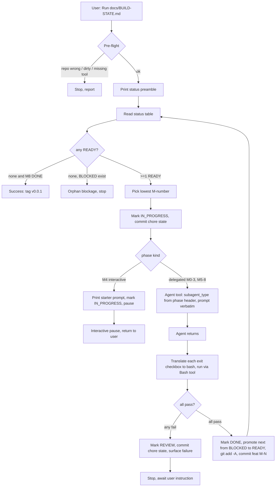
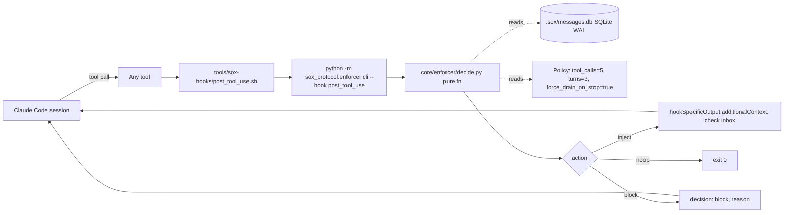
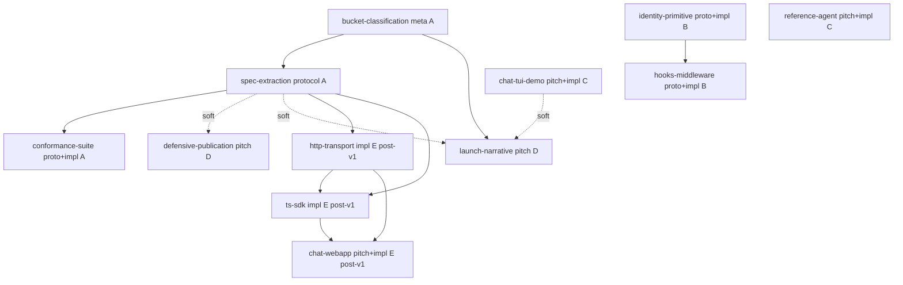
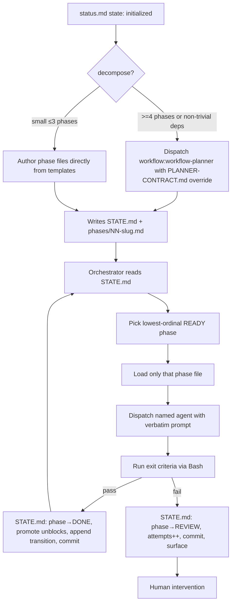

# Workflow analysis — sox-protocol

Generated: 2026-04-29. Delivered by `workflow:workflow-analyzer` (sub-agent contract prohibited self-write; persisted by `workflow-architect`).

## 1. Inventory

### 1.1 Settings / hooks / MCP / permissions

| Item | Path | Summary |
|---|---|---|
| Project settings | `.claude/settings.json` | Registers SOX MCP server (stdio); wires three hooks (`PostToolUse`, `Stop`, `SubagentStop`) all matching `""` (every tool/event); declares `allowedMcpServers: [sox]`. |
| Local settings | `.claude/settings.local.json` | Permission allow-list for `git add/commit`, `bash *`, `python *`, `make test-integration *`, `make demo *`, `chmod +x *`, `ajv --version`, `lint-imports`, plus `mcp__sox__channels__{send,recv,subscribe}`. No deny rules. |
| Project MCP manifest | `.mcp.json` | Duplicate of the `mcpServers.sox` block from settings.json. Same Python module + `SOX_BACKING_STORE=sqlite:////…/sox-protocol/.sox/messages.db`. |
| `PostToolUse` hook | `tools/sox-hooks/post_tool_use.sh` | Pipes Claude Code hook stdin into `python -m sox_protocol.enforcer cli --hook post_tool_use`; translates the returned Decision JSON to `{hookSpecificOutput.additionalContext}` (inject), `{decision: "block", reason}` (block), or noop. Safe-fails on enforcer error (logs to `~/.sox/logs/decisions.jsonl`, exits 0). |
| `Stop` / `SubagentStop` hook | `tools/sox-hooks/stop.sh` | Same shape; `--hook stop`. Returns `block` when `force_drain_on_stop` policy is true and inbox non-empty. Safe-fails identically. |

### 1.2 MCP server

| Server | Transport | Command | Env |
|---|---|---|---|
| `sox` | stdio | `python -m sox_protocol.core.mcp_server` | `SOX_BACKING_STORE=sqlite:////Users/nix/dev/ai/sox-protocol/.sox/messages.db` |

Provides four tools per `docs/CONTRACTS.md §5`: `channels__send`, `channels__recv`, `channels__subscribe`, `channels__list_channels`. Server-supplied instruction string surfaces in agent context as: "SOX Protocol inter-agent channel tools."

### 1.3 Skills

| Skill | Path | Description trigger |
|---|---|---|
| `inter-agent-channels` | `.claude/skills/inter-agent-channels/SKILL.md` | Load when blocked waiting on a peer, broadcasting status, or seeking clarification. Encodes send-and-continue pattern, drain cadence, speculative-then-reconcile recipe. References `mcp__sox__channels__*` tool names directly (placeholders already substituted). |
| `gitnexus-cli` | `.claude/skills/gitnexus/gitnexus-cli/SKILL.md` | Run GitNexus CLI (index, analyze, wiki). |
| `gitnexus-debugging` | `.claude/skills/gitnexus/gitnexus-debugging/SKILL.md` | Trace bugs / errors. |
| `gitnexus-exploring` | `.claude/skills/gitnexus/gitnexus-exploring/SKILL.md` | Codebase exploration / architecture / call traces. |
| `gitnexus-guide` | `.claude/skills/gitnexus/gitnexus-guide/SKILL.md` | Reference for GitNexus tools, MCP resources, schema. |
| `gitnexus-impact-analysis` | `.claude/skills/gitnexus/gitnexus-impact-analysis/SKILL.md` | Pre-edit safety / blast-radius analysis. |
| `gitnexus-refactoring` | `.claude/skills/gitnexus/gitnexus-refactoring/SKILL.md` | Rename, extract, move, restructure. |

### 1.4 Agents

No project-level agents. `.claude/agents/` does not exist in this repo. Agents named in `BUILD-STATE.md` (`api-designer`, `python-pro`, `test-automator`, `content-marketer`, `code-reviewer`, `qa-expert`, `architect-reviewer`, `backend-developer`, `general-purpose`) are referenced as `subagent_type` values but resolve from a global / plugin source not present in the project tree.

### 1.5 Slash commands

None. No `.claude/commands/` directory.

### 1.6 Agent-readable docs (system-shaping)

| Doc | Path | Role |
|---|---|---|
| Build state machine | `docs/BUILD-STATE.md` (785 lines) | Canonical orchestration document. Drives v0 build. Contains operator instructions, status table, nine M0–M8 phases, verbatim agent prompts, exit criteria, and termination conditions. |
| Implementation plan | `docs/IMPLEMENTATION-PLAN.md` (484 lines) | Repo layout + per-milestone deliverables; cited by every BUILD-STATE prompt. |
| Contracts | `docs/CONTRACTS.md` (602 lines) | Schemas, ports, tool semantics; cited by prompts and skill. |
| Design | `docs/DESIGN.md` (384 lines) | Architecture context; cited by prompts. |
| Glossary / Future / Research / Usage | `docs/{GLOSSARY,FUTURE,RESEARCH,USAGE}.md` | Cited by M8 publication prompt and discipline. |
| Engagement README | `.workflow/plans/README.md` | Stream/plan index for the post-v0 v1 push (12 plans, 5 streams). |
| State template | `.workflow/templates/STATE.md` | Authoritative form for engagement-level state files. |
| Phase template | `.workflow/templates/PHASE.md` | Per-phase form; verbatim prompt block + concrete exit criteria; immutable post-commit. |
| Planner contract | `.workflow/templates/PLANNER-CONTRACT.md` | Override block fed to `workflow:workflow-planner`. |

No root `CLAUDE.md` or `AGENTS.md`.

### 1.7 State / escalation directories

| Path | Purpose |
|---|---|
| `.sox/messages.db` (+ `-shm`, `-wal`) | SQLite WAL-mode backing store for SOX channels (per `.mcp.json` env). |
| `.sox/logs/` | Hook safe-fail error log target (`decisions.jsonl`). |
| `.sox/watcher.heartbeat` | Filesystem-watch heartbeat artefact. |
| `.cto/` | Top-level dotdir; present, no README; purpose not declared in inventoried docs. |
| `.workflow/plans/` | 13 engagement directories. Each has a `status.md` with frontmatter. |
| `.workflow/templates/` | Three templates: `STATE.md`, `PHASE.md`, `PLANNER-CONTRACT.md`. |

### 1.8 Engagement plans (the v1 forward queue)

| # | Slug | Bucket | Stream | depends_on | unblocks |
|---|---|---|---|---|---|
| 1 | bucket-classification | meta | A | — | spec-extraction, launch-narrative |
| 2 | spec-extraction | protocol | A | bucket-classification | conformance-suite, defensive-publication, launch-narrative |
| 3 | identity-primitive | protocol+impl | B | — | hooks-middleware |
| 4 | hooks-middleware | protocol+impl | B | identity-primitive | — |
| 5 | conformance-suite | protocol+impl | A | spec-extraction | — |
| 6 | chat-tui-demo | pitch+impl | C | — | launch-narrative |
| 7 | reference-agent | pitch+impl | C | — | — |
| 8 | defensive-publication | pitch | D | — | — |
| 9 | launch-narrative | pitch | D | bucket-classification | — |
| 10 | http-transport | impl | E | spec-extraction | ts-sdk, chat-webapp |
| 11 | ts-sdk | impl | E | spec-extraction, http-transport | chat-webapp |
| 12 | chat-webapp | pitch+impl | E | http-transport, ts-sdk | — |
| meta | sox-protocol-current-state | meta | — | — | — |

All twelve forward plans have `state: initialized`. Only `bucket-classification` has been decomposed into the new `STATE.md` + `phases/` form.

---

## 2. Patterns

- **Orchestration topology — single-file state machine driving hub-and-spoke dispatch (BUILD-STATE.md).** One operator-orchestrator (Claude reading `docs/BUILD-STATE.md`) acts as hub. Spokes are agent dispatches via the `Agent` tool with `subagent_type` from the phase header.
- **Phase = (verbatim prompt block) + (concrete exit-criterion checklist) + (next-state promotion list).** No-paraphrase rule explicit. Exit criteria translated to bash by the orchestrator.
- **State protocol:** `BLOCKED → READY → IN_PROGRESS → REVIEW → DONE`. Forward template adds `ABANDONED`.
- **Git as resumable state.** Every transition committed with conventional message; `claude "Run docs/BUILD-STATE.md"` resumes from latest commit.
- **Two-tier verification gate.** Tier 1 = agent self-report; Tier 2 = orchestrator-run bash exit-criterion checks. Self-report explicitly insufficient. Optional Tier 3 = `code-reviewer` / `qa-expert`.
- **Format migration in flight** from BUILD-STATE.md single-file form to per-engagement `STATE.md` + `phases/NN-slug.md`.
- **Delegation depth = 1.** Operator → executor agent; review gates serial, not nested.
- **Tool privilege at runtime level, not agentic layer.** `.claude/settings.local.json` allow-list, no per-agent restriction.
- **Memory: three-store hybrid** — SQLite (`.sox/messages.db`) for inter-agent channel state; git history (BUILD-STATE.md + plan status); `.cto/` (purpose undocumented).
- **Cadence-enforcer feedback loop.** PostToolUse hook re-injects guidance into Claude's context based on SQLite-backed cadence policy. Visible live (this analysis run repeatedly received "check inbox" injections).
- **Evaluation coverage:** `spec/conformance/` (seven scenarios) is the language-neutral runtime conformance authority. No agent-level eval harness.
- **Forward queue topology:** five parallel streams converging on launch. Critical path: `bucket-classification → spec-extraction → launch-narrative` plus `chat-tui-demo`.

---

## 3. Flow diagrams

### 3.1 BUILD-STATE.md phase advancement

### 3.2 SOX runtime cadence-enforcement loop (orthogonal to phase advancement)

### 3.3 Forward engagement DAG (post-v0 → v1)

### 3.4 Engagement-level state machine (the new template form)

---

## 4. Notable observations (architect attention)

- **Zero project-local agents.** Every `subagent_type` in BUILD-STATE.md and the new plans resolves outside the repo. Portability concern: a fresh checkout has no agent definitions.
- **MCP declaration duplicated** between `.claude/settings.json` and `.mcp.json` (byte-identical). Either consolidate or document why both are needed.
- **All hooks use `matcher: ""`** — fire on every tool/Stop event without filtering. The cadence enforcer surfaced live in this very session (every Read/Bash hit a "check inbox" reminder).
- **Six gitnexus skills present, no gitnexus MCP server declared.** Skills' `mcp__gitnexus__*` calls must resolve against a globally-declared server; if a third party clones the repo without the global, those skills are dead weight. Worth either adding a project MCP entry or removing the skills.
- **`inter-agent-channels` skill has tool names directly substituted**, not as `{{placeholders}}`. Spec keeps placeholders per CONTRACTS §2.1 / M0; install adapter has rendered them. Implication: skill is install-output, not source. Worth confirming where the source lives.
- **BUILD-STATE.md says all phases DONE / "v0.0.1 ready for tagging"** but no `v0.0.1` git tag exists. Tagging is unfinished.
- **`.cto/` exists at repo root with no README** and no inventoried doc explaining its role. Either document or remove.
- **No agent-evaluation harness.** Conformance suite covers SOX-runtime conformance, not agent behaviour. M4 was deliberately interactive because no automated agent eval exists. This is a gap the new engagements should consider.
- **PLANNER-CONTRACT correctly identifies** `bucket-classification` and `defensive-publication` as direct-authoring candidates (≤3 phases, prompts implied by status.md). Confirms the architect's strategy.
- **`force_drain_on_stop=True`** combined with the Stop hook means agents in this repo cannot terminate while messages remain in their SOX inbox unless the enforcer errors. Worth being aware during dev/debug.

---

## 5. Status update

`workflow-architect` should advance `.workflow/plans/sox-protocol-current-state/status.md` from `state: initialized` to `state: analyzed` on receiving this artifact.
