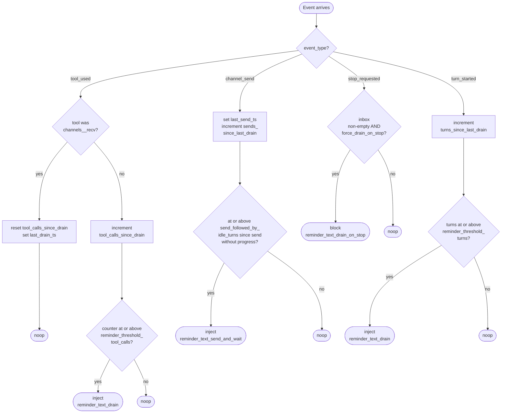
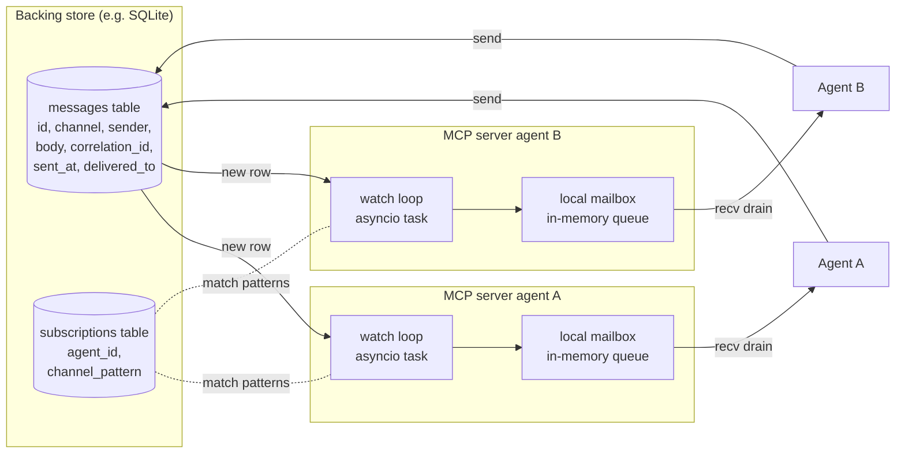

# SOX Protocol — Contracts

This document is the human-readable narrative of the contracts. The **canonical, machine-readable artefacts live in `spec/`** in the repo root:

- JSON Schema files in `spec/schemas/` are the authoritative wire definitions for the enforcer internals (`Event`, `Decision`, `Policy`, `State`) and for the MCP stdio tool I/O (`spec/schemas/tools/`).
- JSON Schema files in `spec/operations/` are the authoritative wire definitions for the HTTP transport binding and conformance suite. Both `spec/schemas/tools/` and `spec/operations/` are kept in sync and are each authoritative for their respective binding.
- Port behaviour contracts in `spec/ports/*.md` are authoritative for atomicity, ordering, and delivery semantics.
- The discipline document at `spec/discipline/discipline.md` is the canonical content rendered by every runtime adapter.
- The conformance test harness in `spec/conformance/` is the verification authority for compliance.

This document mirrors those artefacts in narrative form. **If this document and `spec/` disagree, `spec/` wins.**

> **Note:** The inline schemas in §5 of this document are simplified illustrative excerpts. For normative schemas including all v1 fields (`seq`, `ts`, `reply_to`, `delivered_to`, `origin_server`, `_meta`, `backpressure`, `thread_depth`, `include_meta`, `idempotency_key`, `_sox_protocol` block), see `spec/schemas/tools/` and `spec/operations/`.

**Protocol version:** `1.0` (v0 — pre-implementation; subject to revision before first release).

---

## 1. Overview

SOX Protocol follows the ports-and-adapters (hexagonal) pattern. Adapters exist in two directions: **runtime adapters** (north / driving — Claude Code, OpenAI Agents SDK, LangGraph) and **backing-store adapters** (south / driven — SQLite, filesystem, NATS, Redis). All three adapter ports are first-class.

This document defines:

**Schemas — what the core consumes and produces:**

1. **Discipline document structure** (§2) — required and optional section anchors that a runtime-agnostic discipline markdown file must include.
2. **Enforcer Event / Decision schema** (§3) — the input/output of the pure-function cadence enforcer.
3. **Policy schema** (§4) — operator-tunable parameters.
4. **MCP tool surface** (§5) — the four tools exposed by the SOX MCP server.

**Adapter ports — interfaces that adapters implement:**

1. **Backing-store adapter port** (§6, south / driven): `BackingStore` ABC. Implementations: SQLite, filesystem, in-memory, NATS, Redis.
2. **Runtime adapter ports** (implicit, north / driving): `DisciplineRenderer` and `EnforcerBinding`. Implementations: Claude Code, OpenAI Agents SDK, LangGraph, plain SDK. Defined inline in §7.

**Conformance:**

1. **Adapter conformance checklist** (§7) — parallel checklists for runtime adapters and backing-store adapters.

All schemas are versioned. Adapters and implementations declare which version they target.

---

## 2. Discipline document structure

A SOX discipline document is plain Markdown with required headings (anchors) so adapters can pick subsections for progressive disclosure.

### 2.1 Required headings (level 2, in this exact order)

```markdown
# Inter-agent channels

## When to send
## How to send
## Polling cadence
## The send-and-continue pattern
## The speculative-then-reconcile recipe
## Anti-patterns
## What not to use channels for
```

### 2.2 Optional headings

Documents may include additional level-2 sections after the required ones (e.g., `## Examples`, `## Frequently asked questions`). Adapters MAY render these but MUST render the required eight (counting the H1).

### 2.3 Tool-name placeholders

The discipline body MUST NOT reference concrete MCP tool names. It MUST use the parametrised forms below; the adapter substitutes them at install time:

| Placeholder | Substituted with | Example (Claude Code) |
|---|---|---|
| `{{send_tool}}` | runtime's tool name for sending | `mcp__sox__channels__send` |
| `{{recv_tool}}` | runtime's tool name for receiving | `mcp__sox__channels__recv` |
| `{{subscribe_tool}}` | runtime's tool name for subscribing | `mcp__sox__channels__subscribe` |
| `{{list_tool}}` | runtime's tool name for listing | `mcp__sox__channels__list_channels` |

This keeps the discipline text portable across MCP namespacings and across non-MCP adapters.

### 2.4 Validation

A SOX-conformant discipline document passes the linter:

```bash
python -m sox_protocol.cli lint-discipline core/discipline/discipline.md
```

The linter checks: required headings present, in order, with no level-1 collisions, and no concrete tool names appearing outside placeholders.

---

## 3. Enforcer Event / Decision schema

The cadence enforcer is a pure function:

```python
def decide(event: Event, state: State, policy: Policy) -> Decision: ...
```

### 3.1 `Event`

```python
@dataclass(frozen=True)
class Event:
    schema_version: str           # "1.0"
    event_type: Literal[
        "tool_used",              # any tool call completed
        "channel_send",            # channels__send was called
        "channel_recv",            # channels__recv was called
        "turn_started",            # agent started a new LLM turn
        "stop_requested",          # agent is about to stop
    ]
    agent_id: str
    timestamp: float              # unix epoch seconds
    tool_name: str | None = None  # populated for tool_used
    metadata: dict[str, Any] = field(default_factory=dict)
```

### 3.2 `State`

Per-agent state, persisted across hook invocations.

```python
@dataclass
class State:
    schema_version: str           # "1.0"
    agent_id: str
    tool_calls_since_drain: int = 0
    last_drain_ts: float | None = None
    last_send_ts: float | None = None
    sends_since_last_drain: int = 0
    turns_since_last_drain: int = 0
```

State is read-modify-written transactionally per `decide()` call. Reference implementation persists in SQLite at `${SOX_STATE_DIR}/state.db`.

### 3.3 `Decision`

```python
@dataclass(frozen=True)
class Decision:
    schema_version: str           # "1.0"
    action: Literal["noop", "inject", "block"]
    message: str | None = None    # for inject and block
    reason: str | None = None     # for telemetry / debugging
```

- `noop` — no intervention. `message` MUST be `None`.
- `inject` — runtime SHOULD inject `message` into the agent's next-turn context. `message` MUST be a non-empty string.
- `block` — runtime SHOULD prevent the triggering action from completing and present `message` to the agent. Used primarily for "drain inbox before stopping" enforcement.

### 3.4 Enforcer decision flowchart



### 3.5 Decision semantics by adapter

| Decision | Claude Code adapter | OpenAI Agents SDK adapter | LangGraph adapter |
|---|---|---|---|
| `noop` | exit 0, no output | return None from lifecycle hook | continue graph |
| `inject` | print `{"hookSpecificOutput": {"additionalContext": message}}` to stdout | append `message` as user-role turn | mutate state to inject system message |
| `block` | print `{"decision": "block", "reason": message}` to stdout | raise `LifecycleAbort(message)` | route to a forced-recv node |

---

## 4. Policy schema

Operator-tunable parameters that govern the enforcer.

```python
@dataclass(frozen=True)
class Policy:
    schema_version: str = "1.0"

    # Cadence
    reminder_threshold_tool_calls: int = 5
    reminder_threshold_turns: int = 3
    force_drain_on_stop: bool = True

    # Send-and-stall detection
    send_followed_by_idle_turns: int = 3   # turns after send with no recv → suspect anti-pattern
    suspect_send_and_wait: bool = True

    # Reminder messages (operators can override)
    reminder_text_drain: str = (
        "You have not checked the channels inbox in a while. "
        "Call {{recv_tool}} before continuing if you may be waiting on input."
    )
    reminder_text_drain_on_stop: str = (
        "Inbox not drained. Call {{recv_tool}} and integrate any messages "
        "before completing the task."
    )
    reminder_text_send_and_wait: str = (
        "You sent a message and have not made progress. Per the discipline, "
        "continue under your best-guess interpretation while awaiting reply. "
        "Drain the inbox at the next major decision."
    )
```

Policies are loaded from `${SOX_CONFIG_DIR}/policy.toml` if present, falling back to defaults. Adapters MAY override per-agent.

---

## 5. MCP tool surface

The SOX MCP server exposes 15 operations at protocol version 1.0 (see `spec/protocol.md` for the full operation table). The four core messaging tools (`channels__send`, `channels__recv`, `channels__subscribe`, `channels__list_channels`) plus `channels__ack`, `channels__heartbeat`, `replay`, `channels__collect` (planned), and the group lifecycle and agent discovery tools. Tool names and JSON schemas are normative; see `spec/schemas/tools/` (MCP stdio binding) and `spec/operations/` (HTTP transport and conformance suite).

### 5.1 `channels__send`

**Input schema (illustrative — normative schema: `spec/schemas/tools/send.input.schema.json`):**

```json
{
  "type": "object",
  "required": ["channel", "body"],
  "properties": {
    "channel": {"type": "string", "minLength": 1, "maxLength": 256,
      "description": "Reserved prefixes: dm/<sorted-pair>, group/<group-id>, sox/ (read-only)"},
    "body": {"type": "object"},
    "correlation_id": {"type": ["string", "null"], "maxLength": 128},
    "reply_to": {"type": ["string", "null"],
      "description": "message_id of parent message for threading and deadlock wait-graph"},
    "idempotency_key": {"type": ["string", "null"], "maxLength": 256,
      "description": "Deduplication key; server dedupes within configured TTL (default 24h)"}
  }
}
```

**Output schema (illustrative — normative schema: `spec/schemas/tools/send.output.schema.json`):**

```json
{
  "type": "object",
  "required": ["sent_at", "message_id", "seq", "backpressure"],
  "properties": {
    "sent_at": {"type": "number"},
    "message_id": {"type": "string"},
    "seq": {"type": "integer", "minimum": 1,
      "description": "Per-channel monotone sequence number. Use as since cursor for replay."},
    "backpressure": {"type": "object",
      "required": ["queue_depth", "threshold", "state"],
      "properties": {
        "queue_depth": {"type": "integer", "minimum": 0},
        "threshold": {"type": "integer", "minimum": 1},
        "state": {"type": "string", "enum": ["ok", "warn", "over"]}
      }
    }
  }
}
```

**Semantics:** non-blocking. Returns as soon as the message is durably accepted by the backing store.

### 5.2 `channels__recv`

**Input schema (illustrative — normative schema: `spec/schemas/tools/recv.input.schema.json`):**

```json
{
  "type": "object",
  "properties": {
    "channels": {"type": ["array", "null"], "items": {"type": "string"}},
    "max_messages": {"type": "integer", "minimum": 1, "maximum": 1000, "default": 50},
    "thread_depth": {"type": "integer", "minimum": -1, "default": 0,
      "description": "0: reply_to IDs only. n>0: inline n ancestor envelopes. -1: full chain (server cap: 50)."},
    "include_meta": {"type": "boolean", "default": true,
      "description": "When true, each message includes a _meta observability object."}
  }
}
```

**Output schema (illustrative — normative schema: `spec/schemas/tools/recv.output.schema.json`):**

```json
{
  "type": "object",
  "required": ["drained_at", "messages"],
  "properties": {
    "drained_at": {"type": "number"},
    "messages": {
      "type": "array",
      "items": {
        "type": "object",
        "required": ["channel", "sender", "body", "sent_at", "message_id", "seq"],
        "properties": {
          "channel": {"type": "string"},
          "sender": {"type": "string"},
          "body": {"type": "object"},
          "correlation_id": {"type": ["string", "null"]},
          "sent_at": {"type": "number"},
          "message_id": {"type": "string"},
          "seq": {"type": "integer", "minimum": 1,
            "description": "Per-channel monotone counter. Authoritative ordering key."},
          "ts": {"type": ["integer", "null"],
            "description": "Advisory nanosecond timestamp. Not globally total-ordered."},
          "reply_to": {"type": ["string", "null"]},
          "delivered_to": {"type": ["array", "null"], "items": {"type": "string"}},
          "origin_server": {"type": ["string", "null"],
            "description": "Always null in v1.0 single-server deployments."},
          "_meta": {"type": ["object", "null"],
            "description": "Observability metadata. Present when include_meta=true."}
        }
      }
    }
  }
}
```

**Semantics:** non-blocking. Returns immediately with whatever messages have accumulated since the last drain. If `channels` is null, drains all subscribed channels. Marks returned messages as delivered to this agent.

### 5.3 `channels__subscribe`

**Input schema:**

```json
{
  "type": "object",
  "required": ["pattern"],
  "properties": {
    "pattern": {"type": "string", "minLength": 1, "maxLength": 256}
  }
}
```

**Output schema:**

```json
{
  "type": "object",
  "required": ["subscribed"],
  "properties": {
    "subscribed": {"type": "array", "items": {"type": "string"}}
  }
}
```

**Semantics:** registers interest. Patterns support `*` glob (`ticket:ENGI-*`) and exact match. Subscription persists for the agent's lifetime in the backing store.

### 5.4 `channels__list_channels`

**Input schema:** `{}`

**Output schema (illustrative — normative schema: `spec/schemas/tools/list-channels.output.schema.json`):**

```json
{
  "type": "object",
  "required": ["channels", "_sox_protocol"],
  "properties": {
    "channels": {
      "type": "array",
      "items": {
        "type": "object",
        "required": ["name", "subscriber_count"],
        "properties": {
          "name": {"type": "string"},
          "subscriber_count": {"type": "integer", "minimum": 0}
        }
      }
    },
    "_sox_protocol": {
      "type": "object",
      "required": ["server_version", "supported_versions", "min_client_version"],
      "description": "Version negotiation block. Clients MUST read this on first call and fail-fast if their supported version range does not intersect.",
      "properties": {
        "server_version": {"type": "string"},
        "supported_versions": {"type": "array", "items": {"type": "string"}, "minItems": 1},
        "min_client_version": {"type": "string"}
      }
    }
  }
}
```

**Semantics:** discovery and version negotiation. Returns all channels with at least one subscriber or one stored message in the last 24 hours, plus the mandatory `_sox_protocol` version block. Clients MUST call this first and verify version compatibility before proceeding.

---

## 6. Backing-store adapter port

The `BackingStore` port is the south / driven adapter port. Its **canonical specification is `spec/ports/backing-store.md`** (prose contract: required methods, atomicity, ordering, delivery semantics, watch-loop behaviour). What follows in this section is one *binding* of that port — the Python ABC. Other-language implementations bind the same port in their own idioms (TypeScript: an interface; Rust: a trait); all must conform to the prose contract in `spec/ports/backing-store.md`.

Implementations (SQLite, filesystem, in-memory, NATS, Redis, etc.) are first-class adapters with the same conformance status as runtime adapters — they bind a port, declare a protocol version, and pass both the per-language port-binding tests *and* the language-neutral conformance suite (see §10).



Any storage backend must implement this Python ABC. Other-language ports SHOULD reproduce the same shape.

```python
from abc import ABC, abstractmethod
from typing import AsyncIterator

class BackingStore(ABC):
    """Pluggable persistence layer for SOX messages and subscriptions."""

    schema_version: str = "1.0"

    @abstractmethod
    async def send(
        self,
        channel: str,
        sender: str,
        body: dict,
        correlation_id: str | None = None,
    ) -> tuple[str, float]:
        """Append a message. Returns (message_id, sent_at)."""

    @abstractmethod
    async def recv(
        self,
        agent_id: str,
        channels: list[str] | None = None,
        max_messages: int = 50,
    ) -> list[dict]:
        """Drain messages for agent_id. Atomically marks them delivered."""

    @abstractmethod
    async def subscribe(self, agent_id: str, pattern: str) -> list[str]:
        """Register a subscription. Returns list of currently-matched channels."""

    @abstractmethod
    async def list_channels(self, since: float | None = None) -> list[dict]:
        """List channels with at least one subscriber or recent activity."""

    @abstractmethod
    async def watch(
        self,
        agent_id: str,
    ) -> AsyncIterator[dict]:
        """
        Async generator yielding new messages for this agent.
        Used by the MCP server's listener task to push-receive at the
        network layer, buffering locally for non-blocking recv tool calls.
        """
```

### 6.1 Atomicity requirements

- `send` MUST be atomic: a successful return guarantees the message will be visible to all matching subscribers.
- `recv` MUST be atomic per-agent: a message returned to agent A in one `recv` call MUST NOT be returned to agent A again, even if a concurrent `recv` from another agent is in flight.

### 6.2 Delivery semantics

- v0 ships **at-least-once** delivery: in the failure case of an agent that drained but crashed before integrating, the message is gone (treated as delivered). Operators who require at-least-once with explicit ack can use the `correlation_id` field for de-duplication on their side.
- Stronger semantics (exactly-once with ack) are deferred to v0.2+. See [FUTURE.md](./FUTURE.md) §2.

### 6.3 Ordering guarantees

- Within a single channel, messages are returned to a given agent in send-time order.
- Across channels, no ordering is guaranteed.
- Concurrent sends to the same channel from different agents are ordered by the backing store's tie-break (SQLite: insertion timestamp; NATS: stream sequence).

---

## 7. Adapter conformance checklists

SOX has three adapter ports across two directions. Each port has its own conformance checklist. All three are first-class — adding a new runtime adapter and adding a new backing-store adapter are equivalent kinds of work.

### 7.1 Runtime-adapter conformance — `DisciplineRenderer` (north / driving)

A SOX-conformant runtime adapter for runtime `R` MUST:

- [ ] Accept the discipline markdown source path or content as input.
- [ ] Substitute the four placeholder tokens (`{{send_tool}}`, `{{recv_tool}}`, `{{subscribe_tool}}`, `{{list_tool}}`) with concrete tool names valid in `R`.
- [ ] Render the substituted content into `R`'s prompt-construction surface (skill, instructions, system slot, etc.).
- [ ] Add a one-line bootstrap snippet to participating agents' system prompts.
- [ ] Handle re-installation idempotently (running install twice MUST NOT duplicate content or break the project).

### 7.2 Runtime-adapter conformance — `EnforcerBinding` (north / driving)

A SOX-conformant runtime adapter for runtime `R` MUST:

- [ ] Wire `R`'s lifecycle events into `enforcer.decide()` for at minimum:
  - per-tool-call event (`event_type: "tool_used"`),
  - on-stop event (`event_type: "stop_requested"`).
- [ ] Translate the returned `Decision` into `R`'s mechanism for:
  - injecting context (`Decision.action == "inject"`),
  - blocking the triggering action (`Decision.action == "block"`).
- [ ] Persist enforcer `State` to `${SOX_STATE_DIR}/state.db` shared across all agents in the project.
- [ ] Surface the four MCP tools to participating agents (typically by registering an MCP server in `R`'s MCP client config).

### 7.3 Backing-store-adapter conformance — `BackingStore` (south / driven)

A SOX-conformant backing-store adapter for backend `B` MUST:

- [ ] Implement every abstract method on the `BackingStore` ABC (§6): `send`, `recv`, `subscribe`, `list_channels`, `watch`.
- [ ] Honour the atomicity requirements (§6.1): `send` atomic with respect to subscriber visibility; `recv` atomic per-agent against concurrent recv calls.
- [ ] Provide at minimum at-least-once delivery semantics (§6.2). Stronger semantics MAY be offered as backend-specific extensions.
- [ ] Honour per-channel send-time ordering (§6.3); cross-channel ordering MAY be unspecified.
- [ ] Implement `watch` as an async generator that yields each new matching message exactly once per subscribed agent. The watch loop is what gives the MCP server's listener task its push-receive property at the network layer.
- [ ] Pass the standard parametrised conformance test suite (`tests/conformance/test_backing_store_contract.py` in the reference implementation), which exercises round-trip, concurrent writers, subscription matching, delivery tracking, and watch-loop correctness.
- [ ] Declare which protocol version the adapter targets.
- [ ] Document any backend-specific limitations (e.g., max channel count for filesystem, max message body size for SQLite, ack semantics for NATS).
- [ ] Document any backend-specific extensions (e.g., NATS JetStream's stronger durability options) so operators can opt in explicitly.

### 7.4 Telemetry (recommended for all adapter directions, not required)

- [ ] Log every `Decision` to `${SOX_LOG_DIR}/decisions.jsonl` for debugging (runtime adapters).
- [ ] Log significant store events (subscription, watch-loop start/stop, delivery batch) to a structured log (backing-store adapters).
- [ ] Surface a `verify` command that reports adapter configuration health.

### 7.5 Documentation (required for all adapter directions)

- [ ] An adapter README documenting install steps, configuration, and any limitations.
- [ ] For runtime adapters: a reference example project demonstrating two agents exchanging messages via SOX.
- [ ] For backing-store adapters: documented operational guidance (deployment, sizing, retention, failure modes).

### 7.6 Versioning (required for all adapter directions)

- [ ] Declare which protocol version the adapter targets.
- [ ] Fail fast on protocol version mismatch with an MCP server (runtime adapters) or with the core's `BackingStore` ABC (backing-store adapters).

---

## 8. Versioning policy

- Schemas declare `schema_version` as a string `MAJOR.MINOR`.
- A `MINOR` bump is backward-compatible: implementations of vN.M MUST accept inputs from vN.(≤M).
- A `MAJOR` bump is a breaking change: implementations MUST refuse cross-major interaction and return a clear error.
- The MCP server reports its protocol version in the `_sox_protocol` block of `channels__list_channels()` responses (fields: `server_version`, `supported_versions`, `min_client_version`). The old flat `protocol_version` string is replaced by this structured block.
- Adapters MUST refuse to install against an MCP server with a different `MAJOR` version.
- Clients MUST call `channels__list_channels` on first connection and fail-fast if their supported version range does not intersect with `supported_versions`.

---

## 9. Wire envelope

The canonical wire envelope for a stored/delivered SOX message is defined in `spec/schemas/message.schema.json` and `spec/protocol.md §Message envelope shape`. Required fields: `channel`, `sender`, `body`, `sent_at`, `message_id`, `seq`. Optional fields: `correlation_id`, `ts`, `reply_to`, `delivered_to`, `origin_server`, `_meta`. See those normative sources for full field semantics.

## 9a. Reserved field-name conventions for `body`

The `body` of a message is opaque to SOX, but the discipline document recommends a small set of reserved top-level field names so receivers can dispatch on them:

| Field | Type | Meaning |
|---|---|---|
| `type` | string | Message kind (e.g., `clarification_request`, `clarification_reply`, `status_update`, `handoff_ready`) |
| `subject` | string | Short human-readable summary |
| `context` | string | Background the receiver needs |
| `question` | string | Used by `clarification_request` |
| `answer` | string | Used by `clarification_reply` |
| `urgency` | string | One of `low`, `normal`, `high`. Hints to receivers but does not change protocol behaviour in v0. |

These conventions are recommendations, not requirements. Custom message schemas are permitted; the discipline document's worked examples follow these conventions.

---

## 10. Conformance suite

The verification authority for SOX-compliance is the language-neutral conformance suite at **`spec/conformance/`**. Any implementation that passes it is "SOX v1.0-compliant," irrespective of language, repository, or maintainer.

### 10.1 Shape of the suite

`spec/conformance/` ships:

- `docker-compose.yml` — takes an `IMPLEMENTATION_IMAGE` env var; spins up the implementation's MCP server (any language) and a generic MCP client.
- `scenarios/` — JSON files. Each scenario specifies: required env vars, a sequence of MCP tool calls with arguments, and expected outputs (or output predicates for non-deterministic fields like timestamps and message IDs).
- `runner/run.sh` — bash + jq harness. Iterates scenarios, executes each against the running MCP server, validates outputs against `spec/schemas/` and per-scenario expected outputs.

### 10.2 Scenario coverage

v0 ships at minimum:

| Scenario | What it verifies |
|---|---|
| `01-send-and-recv.json` | Single sender, single receiver; exact round-trip; output conforms to `spec/schemas/tools/recv.output.schema.json`. |
| `02-group-broadcast.json` | One sender, three receivers on the same channel; all three receive. |
| `03-subscription-glob.json` | Glob patterns deliver matching messages only; non-matching channels do not leak. |
| `04-concurrent-writers.json` | N concurrent senders, M concurrent receivers; no loss, no duplication. |
| `05-per-channel-ordering.json` | Within a channel, send-time order preserved per receiver. |
| `06-listener-buffering.json` | Message arrives before recv; first recv drains it. Latency property of the listener watch-loop. |
| `07-recv-atomicity.json` | Recv'd messages not redelivered to the same agent; concurrent recv from another agent does not change this. |

### 10.3 How implementations consume the suite

Each language package ships a thin runner under `packages/<lang>/tests/conformance/` that:

1. Builds (or pulls) a Docker image of the implementation's MCP server.
2. Sets `IMPLEMENTATION_IMAGE` and invokes `spec/conformance/runner/run.sh`.
3. Reports pass/fail per scenario.

The Python reference impl runs this in CI (`python-ci.yml`); badge generation reflects pass/fail (`SOX v1.0 ✓`). Future TS / Rust implementations follow the same pattern with no change to `spec/conformance/`.

### 10.4 What conformance is NOT

Passing the conformance suite verifies wire-level protocol correctness. It does *not* verify:

- Performance (latency, throughput, memory).
- Operational characteristics (durability under crash, restart behaviour).
- Quality of the runtime adapter's prompt-engineering of the discipline.
- Adherence to the host runtime's idioms.

These are implementation quality concerns. v0 does not formalise them; operators evaluate them per implementation.
