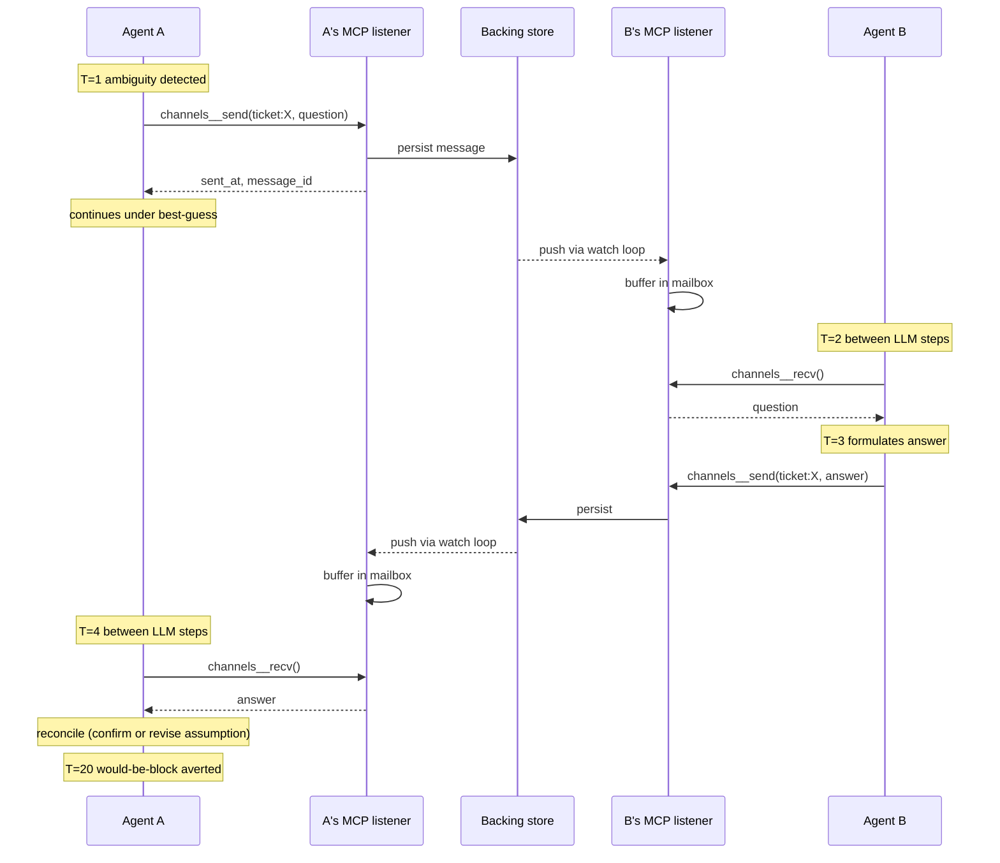
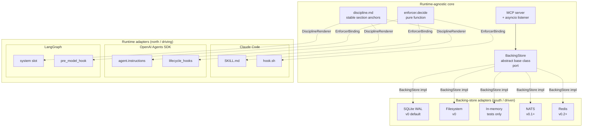

# SOX Protocol — Design

This document covers the problem, the related-work survey, the requirements that distinguish SOX from existing work, the architecture, the design decisions with rationale, and explicit non-goals.

---

## 1. Problem statement

### 1.1 The runtime shape we want

Consider a multi-agent LLM system with N independently-running agents. We want each agent to be able to:

- maintain 0..N concurrent channel memberships (1:1 channels with peers, 1:N broadcast channels, N:N group rooms);
- send a message asynchronously without blocking the sending agent's execution;
- receive messages into a local mailbox that accumulates while the agent is doing other work;
- drain that mailbox at chosen points (between LLM steps, before major decisions) and integrate any messages found.

A motivating scenario: at T=1 agent A is working on a task and notices an ambiguity that, if unresolved, will block progress at T=20. A posts a clarification request to a group channel at T=1, continues working under a best-guess interpretation, and at T=4 finds a reply in its inbox that resolves the ambiguity. A reconciles the reply with its in-progress work — either confirming the best-guess (no rework) or revising the assumption (targeted rework). The block at T=20 never happens.



### 1.2 Why this is not solved by existing frameworks

The surveyed multi-agent LLM frameworks (full list in [RESEARCH.md](./RESEARCH.md)) split into three shapes, none of which fit:

**Turn-taking schedulers.** CrewAI, LangGraph, and OpenAI Swarm run a synchronous scheduler — one agent acts while others are idle. Concurrent execution of A and B is not the runtime model. ([CrewAI hierarchical process](https://docs.crewai.com/en/learn/hierarchical-process), [LangGraph platform](https://docs.langchain.com/langsmith/agent-server))

**Handoff frameworks.** OpenAI Agents SDK handoffs and CrewAI hierarchical delegation transfer control: when A hands off to B, A stops and B starts. There is no "A keeps working while B answers." ([OpenAI Agents SDK](https://openai.github.io/openai-agents-python/))

**Actor-model frameworks with primitives but no packaged discipline.** AutoGen 0.4+ provides actor mailboxes and topic-based pub/sub ([AutoGen topic & subscription](https://microsoft.github.io/autogen/stable/user-guide/core-user-guide/core-concepts/topic-and-subscription.html), [v0.4 announcement](https://www.microsoft.com/en-us/research/articles/autogen-v0-4-reimagining-the-foundation-of-agentic-ai-for-scale-extensibility-and-robustness/)). MetaGPT provides a shared message pool with role-based subscriptions and "act when prerequisites have landed" semantics ([MetaGPT paper](https://arxiv.org/html/2308.00352v6), [MetaGPT agent communication docs](https://docs.deepwisdom.ai/main/en/guide/in_depth_guides/agent_communication.html)). But neither ships a turnkey *pattern* for speculative-execute-while-awaiting — agents either wait for prerequisites (MetaGPT) or are wired by the developer with bespoke reconciliation logic (AutoGen).

**Protocol-layer prior art** — Google's A2A protocol is async-first via push notifications ([A2A streaming & async](https://a2a-protocol.org/latest/topics/streaming-and-async/), [A2A specification](https://a2a-protocol.org/latest/specification/)) but it is task-scoped (client → remote agent → updates) rather than peer-to-peer N:N. The IETF AGNTCY messaging draft ([draft-mpsb-agntcy-messaging-00](https://www.ietf.org/archive/id/draft-mpsb-agntcy-messaging-00.html)) compares messaging substrates (AMQP, MQTT, NATS, Kafka, AGNTCY-SLIM) for agentic AI but does not prescribe a discipline.

**Substrates without LLM shells** — NATS subjects ([NATS docs](https://docs.nats.io/nats-concepts/subjects)), Kafka topics, Ray actors, Akka, Erlang/OTP all give the right shape at the messaging layer but ship no LLM-agent loop on top. Integrators write the agent-side mailbox loop themselves.

### 1.3 The structural gap

The literature surveyed in the [2026-04-28 focused survey](../../../../../../.claude/plugins/workflow/memory/research/agent-runtime-platforms/2026-04-28-async-peer-channels-and-mailboxes.md) concluded:

> No surveyed framework markets a documented pattern for *speculative-execute-while-awaiting-clarification* — i.e., agent works on a best-guess interpretation, then integrates the late clarification non-destructively into its plan/state. This is the harder half of the pattern: not just "wait for prerequisites" (MetaGPT's stance, which still pauses) but "proceed under uncertainty and reconcile."

SOX Protocol's purpose is to fill this gap with a published, runtime-agnostic specification.

---

## 2. Related work

Brief: full annotated bibliography in [RESEARCH.md](./RESEARCH.md). Key items, organised by what they contribute:

### 2.1 Closest mainstream match (incomplete fit)

- **AutoGen 0.4+** — actor model, topics, gRPC distributed runtime. Provides primitives. Discipline is DIY.
  - [Topic and Subscription](https://microsoft.github.io/autogen/stable/user-guide/core-user-guide/core-concepts/topic-and-subscription.html)
  - [Concurrent Agents](https://microsoft.github.io/autogen/stable/user-guide/core-user-guide/design-patterns/concurrent-agents.html)
  - [Distributed Agent Runtime](https://microsoft.github.io/autogen/dev/user-guide/core-user-guide/framework/distributed-agent-runtime.html)
  - [v0.4 announcement (Microsoft Research)](https://www.microsoft.com/en-us/research/articles/autogen-v0-4-reimagining-the-foundation-of-agentic-ai-for-scale-extensibility-and-robustness/)

### 2.2 Closest academic match (partial fit — pauses rather than reconciles)

- **MetaGPT** — shared message pool with role subscriptions; "act once prerequisites have landed" semantics.
  - [MetaGPT paper (arXiv)](https://arxiv.org/html/2308.00352v6)
  - [Agent communication docs](https://docs.deepwisdom.ai/main/en/guide/in_depth_guides/agent_communication.html)

### 2.3 Protocol-layer prior art (wrong topology)

- **A2A (Google → Linux Foundation)** — async-first, push notifications. Task-scoped, not N:N peer.
  - [A2A specification](https://a2a-protocol.org/latest/specification/)
  - [Streaming & async](https://a2a-protocol.org/latest/topics/streaming-and-async/)
- **MCP (Model Context Protocol)** — client→server tools. Wrong shape for peer messaging, but is the integration surface SOX uses for tool exposure.
  - [Claude Code MCP docs](https://code.claude.com/docs/en/mcp)
  - [FastMCP × Claude Code](https://gofastmcp.com/integrations/claude-code)
- **Survey of agent interoperability protocols (MCP/ACP/A2A/ANP)** ([arXiv 2505.02279](https://arxiv.org/html/2505.02279v1))
- **AGNTCY messaging IETF draft** ([draft-mpsb-agntcy-messaging-00](https://www.ietf.org/archive/id/draft-mpsb-agntcy-messaging-00.html))

### 2.4 Substrates (no LLM shell)

- **NATS** — subject-based pub/sub. ([subjects](https://docs.nats.io/nats-concepts/subjects), [homepage](https://nats.io/))
- **Akka actors** — JVM actor model. ([Akka actor model for agentic AI](https://pradeepl.com/blog/agentic-ai/akka-actor-model-agentic-ai/))
- **Ray actors** — Python distributed actor runtime.
- **Erlang/OTP** — original actor-model substrate.
- **LLMs as Actors for Agentic Apps** ([DZone](https://dzone.com/articles/actor-model-agentic-llm-apps))

### 2.5 Library-shaped frameworks

- **Langroid** — actor-inspired, hierarchical task delegation. ([repo](https://github.com/langroid/langroid))

### 2.6 Runtime-feature documentation (load-bearing for adapter design)

- **Claude Code MCP server lifecycle** ([task-master issue #1643 — stdio is per-process](https://github.com/eyaltoledano/claude-task-master/issues/1643))
- **Understanding Claude Code's full stack — MCP, skills, subagents, hooks** ([alexop.dev](https://alexop.dev/posts/understanding-claude-code-full-stack/))
- **OpenAI Agents SDK lifecycle hooks** ([docs](https://openai.github.io/openai-agents-python/agents/#lifecycle-events-hooks))
- **LangGraph pre/post model hooks** ([create-react-agent how-to](https://langchain-ai.github.io/langgraph/how-tos/create-react-agent-hitl/))

---

## 3. Requirements

A useful summary of what distinguishes SOX from each adjacent system:

| Requirement | Description | What rules out which alternative |
|---|---|---|
| **R1. Concurrent execution** | Agent A can think while agent B thinks. | Rules out CrewAI / LangGraph / OpenAI Swarm. |
| **R2. Channel as first-class object** | Named, persistent, multi-member entity. | Rules out point-to-point handoff frameworks. |
| **R3. Non-blocking send** | `send` returns immediately. | Rules out RPC-shaped client→agent protocols. |
| **R4. Asynchronous receive** | `recv` returns immediately with whatever has arrived; agent decides when to drain. | Rules out push-driven interrupt models (also not feasible over MCP — see §5.3). |
| **R5. Group (1:N, N:N)** | A single channel can have N senders and N receivers. | Rules out A2A's task-scoped client↔agent topology. |
| **R6. Deferred reconciliation** | A late-arriving reply must be integrable into in-progress agent state without forcing a stall earlier. | Distinguishes SOX from MetaGPT's "wait for prerequisites" stance. |
| **R7. Runtime-agnostic core** | The discipline and the cadence enforcement must work across Claude Code, OpenAI Agents SDK, LangGraph, AutoGen, and plain SDK loops. | Rules out single-runtime solutions like AutoGen-only. |
| **R8. Bolt-on integration** | Existing agents in any of the above runtimes adopt SOX without rewriting onto a new framework. | Rules out "use AutoGen" as the answer. |

---

## 4. Architecture

The architecture has two parts: the **protocol** (language-neutral; lives in `spec/`) and the **reference implementations** (language-specific; live in `packages/<lang>/`).

The protocol consists of: JSON Schemas for wire types, a markdown discipline document with stable section anchors, port behaviour contracts in prose, and a Docker-based conformance test harness with JSON scenarios. None of the protocol artefacts depend on any programming language.

A reference implementation consists of: a *binding* of each port in the implementation's language (e.g., a Python ABC for `BackingStore`), an MCP server with the four tool surfaces, a cadence enforcer matching the spec schemas, and runtime/backing-store adapters. The implementation imports the canonical discipline and schemas from `spec/`; it does not redefine them.

v0 ships `packages/python/` as the reference implementation. `packages/typescript/` and `packages/rust/` are placeholder directories with READMEs documenting the conformance bar and inviting contributions; the protocol is designed so that implementing them is bounded, well-specified work.

### 4.1 Layer diagram

```text
┌──────────────────────────────────────────────────────────────────┐
│ Layer 5 — System prompt                                          │
│  One-line bootstrap pointer per agent: "channels available; see  │
│  inter-agent-channels skill when blocked or broadcasting."       │
└──────────────────────────────────────────────────────────────────┘
                                ▲
┌──────────────────────────────────────────────────────────────────┐
│ Layer 4 — Cadence enforcer (deterministic, runtime-agnostic)     │
│  Pure function decide(Event) → Decision over per-agent state.    │
│  Adapter wires the runtime's lifecycle events into this.         │
└──────────────────────────────────────────────────────────────────┘
                                ▲
┌──────────────────────────────────────────────────────────────────┐
│ Layer 3 — Discipline (markdown content, runtime-agnostic)        │
│  Opinionated guidance: when to send, polling cadence, anti-      │
│  patterns, the speculative-then-reconcile recipe, examples.      │
│  Adapter renders this into the runtime's prompt surface.         │
└──────────────────────────────────────────────────────────────────┘
                                ▲
┌──────────────────────────────────────────────────────────────────┐
│ Layer 2 — MCP channels server (asyncio listener + tools)         │
│  Background task holds a persistent connection to the store and  │
│  buffers incoming messages locally. Tools: channels__send,       │
│  channels__recv, channels__subscribe, channels__list_channels.   │
└──────────────────────────────────────────────────────────────────┘
                                ▲
┌──────────────────────────────────────────────────────────────────┐
│ Layer 1 — Backing store (pluggable)                              │
│  SQLite (default), filesystem, NATS, Redis. Holds messages       │
│  between sender and receiver. Implements the BackingStore        │
│  interface (see CONTRACTS.md §5).                                │
└──────────────────────────────────────────────────────────────────┘
```

### 4.2 What each layer is responsible for, and what it is not

**Layer 1 — Backing store.** Holds messages. Decides durability semantics (in-memory ephemeral vs WAL-durable vs replicated). Does not know anything about agents or LLMs.

**Layer 2 — MCP server.** Translates the backing store's API into MCP tools the agent can call. Maintains a long-lived listener connection to the store so messages are buffered locally before the agent ever calls `recv`. Does not enforce when the agent calls `recv` (that's Layer 4) and does not contain prompt content (that's Layer 3).

**Layer 3 — Discipline.** Plain markdown. Says when to send, when to drain, what the speculative-then-reconcile recipe looks like, what *not* to use channels for. Stable section anchors (see [CONTRACTS.md](./CONTRACTS.md) §3) so adapters can pick subsections for progressive disclosure.

**Layer 4 — Cadence enforcer.** Pure function. Given an event ("agent X just used tool Y at time T") and the per-agent state (counters, last-drain-timestamp), returns a decision (`noop` / `inject "reminder text"` / `block`). Adapters call this on lifecycle events and translate the decision into the runtime's mechanism. Decoupled from any runtime.

**Layer 5 — System prompt.** One line per agent, naming the discipline. This is the smallest possible bootstrap — it makes the existence of channels known so the agent can elect to load the full discipline when needed.

### 4.3 Adapters

SOX follows the standard ports-and-adapters (hexagonal) pattern with adapters in two directions:

- **Runtime adapters (north / driving)** translate the host runtime's lifecycle events into core operations and render core content into the runtime's prompt-construction surface. Examples: Claude Code, OpenAI Agents SDK, LangGraph.
- **Backing-store adapters (south / driven)** translate core message-store operations into a specific backend's API. Examples: SQLite, filesystem, in-memory, NATS, Redis.

All three adapter contracts (`DisciplineRenderer`, `EnforcerBinding`, `BackingStore`) are first-class and have parallel conformance requirements ([CONTRACTS.md](./CONTRACTS.md) §7). Adding a new runtime is the same kind of work as adding a new backing store — implement the port, pass the conformance test suite.



A SOX runtime adapter is a thin shim implementing two contracts ([CONTRACTS.md](./CONTRACTS.md) §7):

- **DisciplineRenderer** — given the discipline markdown, render it into the runtime's prompt-construction surface (Claude Code skill, OpenAI `agent.instructions`, LangGraph state node, etc.).
- **EnforcerBinding** — wire the runtime's lifecycle events into `enforcer.decide()` and translate `Decision` into the runtime's mechanism for injecting context or blocking.

The reference adapter is `adapters/claude_code/`, which implements DisciplineRenderer as a `SKILL.md` build-time transclusion and EnforcerBinding as a shell hook script registered in `.claude/settings.json`.

Sketched adapters for other runtimes (full implementations deferred to [FUTURE.md](./FUTURE.md)):

- **OpenAI Agents SDK** — DisciplineRenderer loads `discipline.md` into `agent.instructions`. EnforcerBinding registers `lifecycle_hooks` callbacks (`on_tool_end`, `on_end`) that call `enforcer.decide()`.
- **LangGraph** — DisciplineRenderer prepends discipline to the `system` slot of the graph state. EnforcerBinding implements a `pre_model_hook` node that calls `enforcer.decide()` and conditionally injects messages into the graph state.
- **Plain SDK (Anthropic / OpenAI Python directly)** — DisciplineRenderer concatenates discipline into the system message. EnforcerBinding is a documented pattern: caller wraps the main loop and calls `enforcer.decide()` between turns, since these SDKs have no built-in lifecycle hooks.

---

## 5. Design decisions

### 5.1 Why MCP as the integration surface

MCP is now the de-facto industry standard for tool exposure across Claude Code, Cursor, Cline, OpenAI desktop apps, and many third-party clients ([MCP × Claude Code](https://gofastmcp.com/integrations/claude-code)). An MCP-shaped channel layer is the closest thing available to a runtime-neutral integration surface for LLM tools.

Trade-offs accepted:

- **Pull-only at the LLM layer.** MCP is request-response, client-initiated. The agent decides when to call `channels__recv`. We cannot push messages directly into an in-flight LLM turn. Mitigation: the MCP server maintains a *push-receive* connection at the network layer (background asyncio task with long-poll or websocket subscribe), so messages arrive at the MCP server within milliseconds of being sent and sit in a local in-memory queue until the agent next drains. End-to-end latency is bounded by polling cadence at the agent layer, not by network round-trips.
- **Tool-call token cost.** Each `recv(timeout=0)` is ~50–200 tokens of context (call + result + framing). Mitigation: batch-drain across all subscribed channels in one tool call.

### 5.2 Why a shared backing store rather than direct peer connections

Peer-to-peer agent connections require runtime discovery (where is agent B reachable?) and per-pair connection setup. A shared store collapses this to: every agent's MCP server connects to one place; addressing is by channel name or recipient ID, not by network address. Cheaper to operate, simpler to reason about, easier to debug (you can inspect the store directly).

The backing store is pluggable specifically because the right choice depends on lifetime:

| Backing store | Setup cost | Latency | Durability | Right for |
|---|---|---|---|---|
| SQLite (WAL mode) | Zero deps | ms | Survives session | Session-scoped multi-agent, ≤ ~50 msgs/sec |
| Filesystem inbox | Zero deps | ms | Survives session | Same scale; easiest to debug |
| Tiny asyncio TCP relay | One process | sub-ms | Ephemeral | Real-time, no persistence needed |
| NATS / Redis | Real ops | sub-ms | Configurable | Daemon-scoped, high fanout, multi-host |

v0 ships SQLite as the default. Filesystem and NATS adapters are documented in [FUTURE.md](./FUTURE.md).

### 5.3 Why polling (not push) at the agent layer

We considered three options for delivering messages to the agent:

1. **Pure pull.** Agent calls `recv` between LLM steps. Simple. Discipline-dependent.
2. **Push-via-injection.** A hook detects new messages and injects "you have N new messages" into the agent's next turn. Removes some discipline burden but requires a hook on every adapter.
3. **Push-via-interrupt.** Kill and respawn the agent process when a high-priority message arrives. Operationally complex; semantically violent (agent loses in-flight reasoning).

v0 ships option 1 (pull) with optional reinforcement from option 2 (cadence enforcer can inject reminders, not full message contents — those still come through `recv`). Option 3 is documented as a non-goal in [FUTURE.md](./FUTURE.md) §4. The pull-only model preserves agent autonomy: the agent decides when its reasoning is at a checkpoint where new context can be safely integrated.

### 5.4 Why discipline as separate markdown rather than embedded in code

Three reasons:

- **Composability.** One discipline document is loaded by N agents across M runtimes. Embedding it in code or per-agent prompts requires N × M maintenance.
- **Iteration.** The speculative-then-reconcile recipe is a *prompt-engineering* artefact. Iteration on it is markdown editing, not code editing. Reviewers can diff it without reading code.
- **Adapter simplicity.** Adapters render markdown, not behaviour. This keeps adapters under ~100 lines each.

### 5.5 Why pure-function enforcer rather than embedded lifecycle code

The cadence rules are a tiny, testable domain:

- "If N tool calls have happened without a `channels__recv`, inject a reminder."
- "If the agent attempts to stop without draining, block and force a drain."
- "If the agent calls `send` and the next 3 turns are pure reasoning without progress, suspect send-and-wait anti-pattern; inject a reminder of the speculative pattern."

Expressing these as a pure `decide(Event, State, Policy) → Decision` function lets us:

- **Test exhaustively.** Synthetic event sequences run through `decide()` in pytest in milliseconds.
- **Configure declaratively.** `Policy` is a dataclass; tweaking thresholds is data, not code.
- **Reuse across adapters.** All adapters share one enforcer module; only the I/O changes.

### 5.6 Why "channel" naming convention is keyed on task/ticket IDs

Group channels keyed on the task or ticket the agents are collaborating on (`ticket:ENGI-0042`, `task:auth-rewrite`) is the natural scoping. It avoids the addressing problem (agents don't need to know each other's IDs; they just join the room for the task). Direct channels (`agent:<id>`) and broadcast channels (`broadcast:cto-announcements`) are also supported. Naming convention is documented in [USAGE.md](./USAGE.md).

---

## 6. Non-goals (for v0)

Each is documented in [FUTURE.md](./FUTURE.md) with deferral rationale.

- **N6.1** Push-based interrupts that preempt in-flight LLM turns.
- **N6.2** Authoritative ordering / causal consistency. v0 is best-effort ordering per channel as the backing store delivers it.
- **N6.3** Speculative-execute-and-reconcile pattern *library* beyond a single recipe in the discipline doc. v0 documents one recipe; FUTURE.md outlines the longer pattern catalogue.
- **N6.4** Cross-organisation / cross-trust-boundary messaging (would need an A2A bridge).
- **N6.5** Authentication, authorization, or end-to-end encryption.
- **N6.6** Adapters for runtimes other than Claude Code in v0. (OpenAI Agents SDK and LangGraph adapters are the v0.1 priorities; AutoGen interop is more speculative.)
- **N6.7** Graphical introspection / observability tooling.
- **N6.8** Vector-clock or hybrid-logical-clock causality tracking.

---

## 7. Open problems

These are problems we cannot pretend SOX solves at v0 and would benefit from public input:

### 7.1 Reconciliation when the agent has committed to a path

The discipline says "post a clarification, continue under best-guess, integrate the late reply non-destructively." The hard case is when the agent has already taken irreversible actions (tool calls, file writes) based on the best guess and the late reply contradicts it. The discipline can guide the *recognition* of this state and recommend rollback procedures, but rollback semantics are agent-task-specific. SOX does not solve them; it surfaces them.

Closest analogues outside the LLM space:

- **Speculative execution in CPUs** — branch prediction with rollback. Requires bounded speculation and a checkpoint mechanism.
- **Optimistic concurrency control in databases** — CRDTs, operational transform. Requires a merge function defined for the data type.

Neither has been mapped onto LLM-agent context state in published work the author is aware of. This is the pattern-library gap from §1.3 and is documented further in [FUTURE.md](./FUTURE.md) §3.

### 7.2 Discipline drift across model versions

The discipline document is prompt-engineered. A discipline that works well on Claude Sonnet 4 may degrade on Sonnet 4.5 or on GPT-5. v0 has no automated regression testing for discipline effectiveness. [FUTURE.md](./FUTURE.md) §6 sketches a discipline-effectiveness benchmark.

### 7.3 Polling-cadence calibration

The default policy (cadence reminder after N tool calls without a drain) is a heuristic. Optimal N varies by task type, agent role, channel volume, and model. v0 ships sensible defaults; calibration is left to operators.

---

## 8. Relationship to existing standards

- **MCP.** SOX builds on MCP as the tool-exposure surface. SOX is not a replacement for MCP and could not exist without it.
- **A2A.** SOX is complementary. A2A handles task-scoped client↔agent calls (including across organisational boundaries); SOX handles intra-trust-domain peer messaging. A future A2A↔SOX bridge is documented in [FUTURE.md](./FUTURE.md) §5.
- **AGNTCY.** SOX's backing store is precisely the layer the AGNTCY messaging draft analyses. SOX takes no position on which substrate is best; it provides an interface. A NATS-backed SOX backing store is explicitly compatible with AGNTCY recommendations.
- **AutoGen / MetaGPT / Langroid.** SOX is a *protocol* and *discipline*, not a framework. An adapter could in principle let an AutoGen-shaped multi-agent system join a SOX channel network; this is documented in [FUTURE.md](./FUTURE.md) §6.
