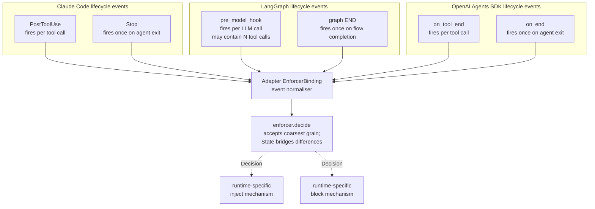

# SOX Protocol — Future work

Features deliberately deferred from v0. Each entry has a deferral rationale, an estimated complexity for adding later, and (where useful) prior art that would inform implementation.

This document is also the public roadmap. Anyone interested in contributing post-v0 should start here.

---

## 0. Additional language implementations (open to contributions)

The SOX monorepo has placeholder directories `packages/typescript/` and `packages/rust/` at v0. Both are unimplemented; both are explicitly open to contributions. The conformance bar is fixed: pass `spec/conformance/scenarios/` against the implementation's MCP server. Suggested architecture mirrors `packages/python/` (core/ports + core/enforcer + core/mcp_server + adapters/runtimes + adapters/backing_stores).

To contribute a new language implementation:

1. Open an issue claiming the package directory.
2. Mirror the `packages/python/` layout in your language's idiom.
3. Implement the four MCP tools, the cadence enforcer (per `spec/schemas/event.schema.json` and `spec/schemas/decision.schema.json`), and at minimum the SQLite backing-store adapter.
4. Add a per-language conformance runner under `packages/<lang>/tests/conformance/` that loads `spec/conformance/scenarios/` and runs them against your MCP server.
5. Submit a PR; merge gates on the conformance suite passing.

Per-language priority is community-driven. The author's expectation is **TypeScript first** (largest LLM-tooling overlap with Python; mature MCP TS SDK; Claude Code itself is JS). **Rust second** (operators wanting a single-binary daemon-shaped MCP server; lowest resource footprint for long-running deployments). Other languages welcomed; create an issue first.

The remainder of this document covers feature work within the *Python* reference implementation that is deferred from v0 — additional runtime adapters, stronger delivery semantics, additional backing-store adapters, etc.

---

## 1. Additional runtime adapters (Python reference impl)

Each runtime exposes lifecycle events at a different grain. The SOX adapter normalises these into the enforcer's `Event` schema; per-agent state in the enforcer (`State`) bridges any grain mismatches so policy thresholds expressed in tool-call counts remain meaningful even when the host runtime fires hooks per-LLM-call.

### 1.1 OpenAI Agents SDK adapter (priority: v0.1)

**Why deferred:** scope. v0 ships the Claude Code adapter as proof; portability claims are validated by the *design* (the discipline + enforcer are runtime-agnostic by construction), not by shipping every adapter at once.

**Complexity estimate:** ~3–5 days. The adapter is small:

- DisciplineRenderer: load `discipline.md`, substitute placeholders, set `agent.instructions`.
- EnforcerBinding: register `lifecycle_hooks` callbacks (`on_tool_end`, `on_end`, `on_handoff`); wire to `enforcer.decide()`.
- Test: end-to-end two-agent demo.

**References:**

- [OpenAI Agents SDK](https://openai.github.io/openai-agents-python/)
- [Agents SDK lifecycle events / hooks](https://openai.github.io/openai-agents-python/agents/#lifecycle-events-hooks)

### 1.2 LangGraph adapter (priority: v0.1)

**Why deferred:** scope.

**Complexity estimate:** ~5–7 days. Slightly more involved than the OpenAI SDK adapter because LangGraph's hook surface is a graph node, not a callback. The adapter must:

- DisciplineRenderer: prepend discipline to `system` slot of the graph state.
- EnforcerBinding: insert a `pre_model_hook` node that calls `enforcer.decide()` and conditionally injects messages into graph state.
- Handle the event-grain mismatch: LangGraph's hook fires per-LLM-call (potentially containing multiple tool calls); the adapter calls `enforcer.decide()` once per LLM-call event but passes accurate `tool_used` counts via `Event.metadata`.

**References:**

- [LangGraph create-react-agent how-to](https://langchain-ai.github.io/langgraph/how-tos/create-react-agent-hitl/)

### 1.3 AutoGen 0.4+ interop adapter (priority: v0.2, speculative)

**Why deferred:** AutoGen has its own actor + topic-pub/sub model. SOX-on-AutoGen isn't simply an adapter; it's a question of whether to map AutoGen's topics onto SOX channels (1:1 bridge) or run them in parallel.

**Complexity estimate:** ~2 weeks; design-heavy.

**Prior art:**

- [AutoGen distributed agent runtime](https://microsoft.github.io/autogen/dev/user-guide/core-user-guide/framework/distributed-agent-runtime.html)
- [AutoGen topic and subscription](https://microsoft.github.io/autogen/stable/user-guide/core-user-guide/core-concepts/topic-and-subscription.html)

### 1.4 Plain-SDK adapter (priority: v0.1)

**Why deferred:** the plain SDK case (Anthropic Python, OpenAI Python directly) has no built-in lifecycle hooks. The "adapter" is necessarily invasive — a documented wrapper pattern around the user's main loop.

**Complexity estimate:** ~2 days. Mostly documentation; the code is a thin `interleave()` helper.

---

## 2. Stronger delivery semantics

### 2.1 Exactly-once with explicit ack (priority: v0.2)

v0 is at-least-once. Some workloads (irreversible actions triggered by messages) need exactly-once with an ack mechanism so a message is not redelivered after partial processing.

**Complexity estimate:** ~1 week. Requires:

- `channels__ack(message_id)` tool.
- Two-phase delivery in the backing store (visible-to-receiver → acknowledged).
- Timeout-and-redelivery for messages drained but not acked.

**Prior art:** AMQP ack semantics, NATS JetStream consumer ack types ([NATS docs](https://docs.nats.io/)).

### 2.2 Causal ordering / vector clocks (priority: v1.0+)

v0 has no causal-ordering guarantees beyond per-channel send-time ordering. Some multi-agent reasoning patterns benefit from causal consistency.

**Complexity estimate:** weeks; design-heavy. Vector clocks or hybrid logical clocks attached to messages, with the backing store enforcing happens-before. Substantial complexity for a niche benefit; deferred until a real workload demands it.

**Prior art:** Lamport timestamps, vector clocks, hybrid logical clocks (HLC).

---

## 3. Speculative-execute-and-reconcile pattern library

The v0 discipline document includes one recipe for the speculative-then-reconcile pattern. As discussed in [DESIGN.md §7.1](./DESIGN.md#71-reconciliation-when-the-agent-has-committed-to-a-path), this is the structurally underserved corner of the field.

A future pattern library would document multiple recipes for different reconciliation scenarios:

- **Idempotent best-guess** — actions that are safe to redo or supersede.
- **Compensating-action rollback** — late reply triggers an undo (file revert, request revocation, etc.).
- **CRDT-style merge** — conflict-free merge of best-guess output and corrected output for compatible data types.
- **Operational-transform reconciliation** — for sequential edits where order matters.
- **Speculative-checkpoint + replay** — like CPU branch prediction; checkpoint state at speculation, replay from checkpoint with correct branch on reply.

**Why deferred:** the gap is large enough to merit a separate research project. The v0 discipline ships *one* recipe so the protocol is useful immediately; the broader catalogue is its own publishable artefact.

**Prior art:**

- Speculative execution and branch prediction in CPU microarchitecture.
- Optimistic concurrency control in databases.
- CRDTs (Shapiro et al., 2011 onwards).
- Operational Transformation (Ellis & Gibbs, 1989).

---

## 4. Push / preemptive interrupts

### 4.1 The non-goal

v0 is pull-only at the LLM layer. Push-style preemptive interrupts (where a high-priority message kills and respawns the agent or otherwise interrupts the in-flight LLM turn) are a non-goal in v0.

**Why:** preemption violates agent autonomy and produces poor reasoning behaviour (model loses in-flight reasoning when context is replaced). The cost (interrupt machinery, context surgery) is high; the benefit (~seconds-faster delivery of high-priority messages) is low for the workloads SOX targets.

### 4.2 What may land later

A *cooperative* preemption mechanism: an agent advertises checkpoint moments where it's willing to be interrupted, the cadence enforcer's `block` action becomes more useful, and the discipline grows a section on "high-priority message" handling. This is consistent with v0's pull model — the agent still chooses, just earlier.

**Complexity estimate:** ~1 week if the underlying runtime supports synchronous-block hooks (Claude Code does).

---

## 5. Cross-organisation messaging via A2A bridge

SOX is intra-trust-domain. Cross-organisation peer messaging is what A2A is for ([A2A spec](https://a2a-protocol.org/latest/specification/)).

A future SOX↔A2A bridge would let:

- An A2A client send a task to a SOX agent (translated to a SOX channel send).
- A SOX agent post to an A2A server's `SubscribeToTask` (translated from a channel send).
- A2A push-notification webhooks deliver to a SOX channel.

**Complexity estimate:** ~2 weeks. The translation surface is well-defined but the trust-boundary semantics (auth, signing, idempotency across the bridge) is non-trivial.

**Why deferred:** SOX v0 audience is intra-trust-domain. Adding cross-org would force auth/encryption decisions before the core protocol stabilises.

---

## 6. Adjacent observability and tooling

### 6.1 Live channel tail / introspection UI

`python -m sox_protocol.cli tail <channel>` ships in v0 as a basic terminal command. A graphical TUI or web UI would make multi-channel monitoring far easier.

**Complexity estimate:** ~3 days for a TUI (rich, textual); ~2 weeks for a web UI.

### 6.2 Discipline-effectiveness benchmark

The discipline document is prompt-engineered. It can degrade across model versions or in domains it wasn't tuned for. A benchmark suite would:

- Define a synthetic multi-agent task with known correct outcomes.
- Run agents under different model versions and discipline variants.
- Measure: clarification latency, false-positive sends, send-and-wait incidence, reconciliation correctness rate.
- Report regression versus baseline.

**Complexity estimate:** ~2 weeks for the harness; ongoing for benchmark maintenance.

**Why valuable:** without a benchmark, the discipline drifts silently as models change.

### 6.3 Decision-log visualisation

Decisions logged to `${SOX_LOG_DIR}/decisions.jsonl` would benefit from a viewer (timeline + filter). v0 ships JSONL only.

**Complexity estimate:** ~1 week.

---

## 7. Backing store implementations

v0 ships SQLite (default), filesystem, and in-memory (tests).

### 7.1 NATS

**Priority:** v0.1.

**Why valuable:** session-scoped SQLite caps at ~50 msg/sec. Daemon-scoped multi-agent systems (e.g., long-running supervisors orchestrating dozens of agents) need a real broker. NATS subjects map cleanly onto SOX channels ([NATS subjects docs](https://docs.nats.io/nats-concepts/subjects)). JetStream gives durability when needed.

**Complexity estimate:** ~3 days. A single Python class implementing `BackingStore` against `nats-py`.

### 7.2 Redis (Streams or pub/sub)

**Priority:** v0.2.

**Why deferred:** NATS covers most of the same use cases more cleanly. Redis ships when there's specific demand (e.g., projects already running Redis).

**Complexity estimate:** ~3 days.

### 7.3 PostgreSQL LISTEN/NOTIFY

**Priority:** v0.2.

**Why valuable:** projects that already run Postgres can avoid adding a second persistence service. LISTEN/NOTIFY gives push-receive at the connection layer.

**Complexity estimate:** ~3 days.

---

## 8. Multi-tenant and security

### 8.1 Authentication and authorisation

v0 has none. Trust is by deployment: only agents in the same project filesystem / same MCP-server config can talk.

For multi-tenant deployments (multiple projects sharing one backing store), need:

- Per-channel ACLs.
- Per-agent capability tokens (similar to MCP capability discussions).
- Optional end-to-end encryption of message bodies.

**Complexity estimate:** ~2–3 weeks.

**Prior art:** OWASP Agentic Threats, MITRE ATLAS, NIST AI RMF, EU AI Act.

### 8.2 Audit log and tamper-evidence

For compliance / regulated environments, message history may need to be tamper-evident. Hash-chain over the SQLite log is a small change with material value for audit posture.

**Complexity estimate:** ~1 week.

---

## 9. Multi-supervisor / distributed deployments

v0 assumes one backing store. Distributed deployments (e.g., regional supervisors with eventually-consistent message replication) are out of scope.

**Why:** the use cases for SOX (intra-project peer messaging) are typically single-region. Distributed peer messaging is a different problem with substantially different design constraints.

**Prior art if pursued:** CRDT-replicated message stores; AGNTCY-SLIM for inter-supervisor protocols ([AGNTCY messaging draft](https://www.ietf.org/archive/id/draft-mpsb-agntcy-messaging-00.html)).

---

## 10. Discipline document evolution

### 10.1 Localised disciplines

v0 ships one discipline document. Some teams may want to fork it for domain-specific patterns (e.g., a security-team SOX discipline that emphasises confidentiality classes; a research-team discipline that emphasises hypothesis-and-evidence formats).

**Path forward:** document a "discipline fork" pattern in v0.1 — a fork inherits required section anchors and adds custom ones. Adapters render the fork.

**Complexity estimate:** ~2 days, mostly documentation.

### 10.2 Per-role disciplines

Different agent roles may benefit from different discipline emphasis. A QA agent's polling cadence and reconciliation patterns may differ from an implementation agent's.

**Path forward:** the adapter can install multiple skills, each named for the role. The bootstrap snippet picks the right one based on agent role metadata.

**Complexity estimate:** ~3 days.

---

## 11. Things ruled out (not future work)

These are non-goals not just deferred:

- **Replacing MCP.** SOX is built on MCP. We will not duplicate or compete with it.
- **A new agent framework.** SOX is a protocol + discipline. It does not run agents; it lets agents talk.
- **A general-purpose pub/sub broker.** SOX is opinionated for LLM agent peer messaging. Use NATS / Kafka / Redis directly for general-purpose messaging.
- **A workflow engine.** Use Temporal, Inngest, or LangGraph for durable workflow execution. SOX coexists with workflow engines; it does not replace them.
