# Message Lifecycle — State Machine

**Protocol version:** 1.0  
**Status:** Normative

---

## 1. Overview

A SOX message moves through a defined sequence of states from the moment a sender issues a `send` call to the moment each subscribed receiver has processed it. The lifecycle is tracked per message per subscriber — the same message can be in different states for different agents simultaneously.

---

## 2. States

| State | Description |
|---|---|
| `sending` | The `{{send_tool}}` call has been issued by the sender; the backing store has not yet confirmed durability. |
| `stored` | The backing store has accepted the message and returned `(message_id, sent_at)`. The message is immediately visible to all matching `watch` loops. |
| `buffered` | The MCP server's listener task has received the message from the `watch` stream and placed it in the agent's local in-memory mailbox. (Per-agent state.) |
| `delivered` | The agent called `{{recv_tool}}` and the message was included in the response; it was atomically marked as delivered in the backing store. |
| `acked` | The receiver sent a `sox-ack` back to the originating channel. (Application-layer state; optional.) |
| `replied` | The receiver sent a reply message (e.g. `clarification_reply`) referencing the original `correlation_id`. (Application-layer state; optional.) |
| `nacked` | The receiver sent a `sox-nack` back to the originating channel. (Application-layer state; optional.) |

---

## 3. State transition diagram

```mermaid
stateDiagram-v2
    [*] --> sending : sender calls {{send_tool}}

    sending --> stored : backing store confirms durability
    sending --> error : backing store rejects (send fails)

    stored --> buffered : watch loop delivers to agent mailbox
    stored --> delivered : agent calls recv; message returned directly from store\n(if not yet buffered)

    buffered --> delivered : agent calls recv; message drained from local mailbox

    delivered --> acked : receiver sends sox-ack (optional)
    delivered --> replied : receiver sends clarification_reply (optional)
    delivered --> nacked : receiver sends sox-nack (optional)
    delivered --> [*] : message consumed; no further ACK required

    acked --> [*]
    replied --> [*]
    nacked --> [*]

    error --> [*]
```

---

## 4. Protocol-layer vs application-layer states

The SOX protocol tracks states up to and including `delivered`. States `acked`, `replied`, and `nacked` are application-layer states maintained in the agent's reasoning context, not in the backing store.

| State | Tracked by |
|---|---|
| `sending` | Caller (before tool returns) |
| `stored` | Backing store (`message_id` existence) |
| `buffered` | MCP server listener (local mailbox) |
| `delivered` | Backing store (delivered-to set per agent) |
| `acked` / `replied` / `nacked` | Agent application context (via `correlation_id` matching) |

---

## 5. Error state

If `send` fails (backing store rejects the message), the message MUST NOT enter the `stored` state. The calling agent's tool call returns an error. The message is not recoverable from the protocol's perspective; the agent must retry.

A failed `send` MUST NOT leave a partially-persisted message that could be returned by a subsequent `recv`. (See `spec/ports/backing-store.md §2.1 — Failure`.)

---

## 6. Delivery atomicity

The transition from `buffered` (or `stored`) to `delivered` is a single atomic operation per agent. A message that transitions to `delivered` for agent A MUST NOT transition to `delivered` for agent A again, even under concurrent `recv` calls. (See `spec/ports/backing-store.md §3.2`.)

---

## 7. At-least-once caveat

If the MCP server crashes after draining the local mailbox but before the agent integrates the messages, the messages are lost at the protocol layer (they are marked `delivered` in the backing store). The agent must manage its own pending state to detect and handle this case. (See `spec/primitives/pending-state.md`.)
